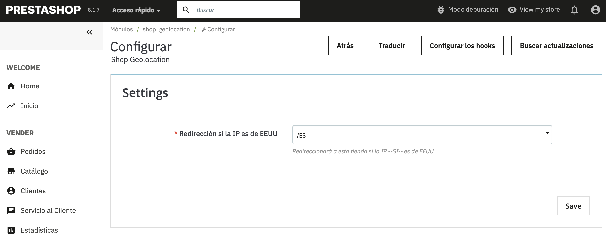

# shop_geolocation
Módulo para PrestaShop que detecta automáticamente el país del visitante mediante su IP y redirige a la tienda correspondiente según su ubicación geográfica.  Es ideal para tiendas multitienda que operan en diferentes países o regiones. El módulo también muestra un modal informativo si el usuario accede a una tienda incorrecta según su ubicación.



# Shop Geolocation

**Versión:** 1.0.0  
**Autor:** Sebastián Luna  
**Compatibilidad:** PrestaShop 1.7+  
**Licencia:** Academic Free License (AFL 3.0)

## Descripción

`Shop Geolocation` es un módulo para PrestaShop que detecta automáticamente el país del visitante mediante su IP y redirige a la tienda correspondiente según su ubicación geográfica.

Es ideal para tiendas multitienda que operan en diferentes países o regiones. El módulo también muestra un modal informativo si el usuario accede a una tienda incorrecta según su ubicación.

✅ **Compatible con Cloudflare**: soporta la cabecera `HTTP_CF_CONNECTING_IP` para obtener correctamente la IP real del usuario.

---

## Funcionalidades

- 🚀 **Redirección automática** de usuarios a la tienda correspondiente según su país.
- 🌍 Soporte para múltiples países y una tienda "internacional" por defecto.
- 💬 Modal emergente que notifica al usuario cuando no se encuentra en la tienda adecuada.
- ⚙️ Panel de configuración en el Back Office para seleccionar el comportamiento para IPs específicas (por ejemplo, redirección para EE. UU.).
- 🧠 Integración con el sistema de multitienda de PrestaShop.
- 🔐 Soporte para conexiones SSL.
- 🍪 Utiliza cookies para evitar redirecciones repetidas.

---

## Configuración

1. **Instalación**
   - Sube la carpeta del módulo a `/modules/shop_geolocation/`.
   - Activa el módulo desde el Back Office de PrestaShop.

2. **Ajustes**
   - Ve a la configuración del módulo.
   - Selecciona la tienda a la que deben redirigirse los usuarios de EE. UU. (u otro país definido en el código como `CHECK_ISO`).
   - Guarda los cambios.

---

## Países Soportados

Por defecto, el módulo distingue entre:

- **España (ES)** – País que se gestiona como tienda individual.
- **Estados Unidos (US)** – País que activa la redirección a una tienda específica (configurable).
- **Resto del mundo** – Son considerados como "Internacional" y se redirigen a la tienda con ID configurado como `INTERNATIONAL_ID_SHOP`.

Estos valores pueden modificarse directamente en el código si deseas agregar más países.

---

## Personalización

Si necesitas cambiar los países que se tratan como individuales, modifica la constante en el archivo principal del módulo:

```php
const DEFAULT_COUNTRIES_TO_BE_DISPLAYED = array('ES');


Consideraciones de uso
Es necesario tener habilitada la base de datos GeoIP2 en tu servidor.

Si usas Cloudflare, asegúrate de que la opción “Rewrite visitor IP” esté desactivada para evitar conflictos.

Las redirecciones solo se ejecutan si no existe una cookie shop_geolocation.

Archivos Clave
/shop_geolocation.php: lógica principal del módulo.

/views/templates/widget/modalRedirect.tpl: plantilla del modal de redirección.

/views/js/front.js y /views/css/front.css: scripts y estilos para el front-end.


